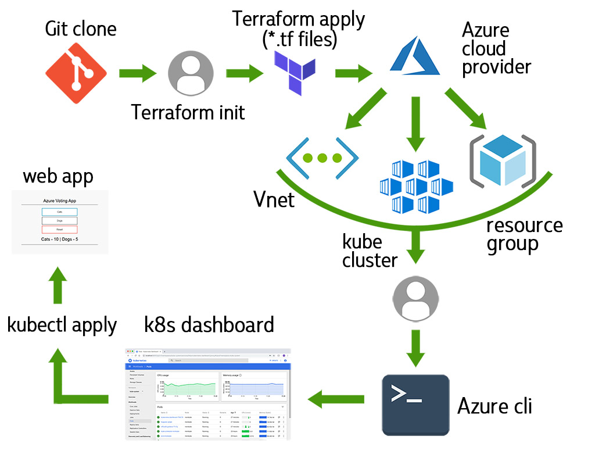

<h1 align="center"> Azure-Terraform-Kubernetes </h1>

#### GL DevOps Pro Camp. Work by Evgeniy Naryshkin



## About:

This Terraform code deploys Azure infrastructure and Kubernetes cluster using Azure Kubernetes Service
All the parameters listed in *variables.tf* file.

To connect to Your Azure Subscribtion You must add *terraform.tfvars* file that includes Your secrets:

```sh
subscription_id = "xxxxxxxx-xxxx-xxxx-xxxx-xxxxxxxxxxxx"
client_id = "xxxxxxxx-xxxx-xxxx-xxxx-xxxxxxxxxxxx"
client_secret = "some-combination-of-symbols"
tenant_id = "xxxxxxxx-xxxx-xxxx-xxxx-xxxxxxxxxxxx"
```

***Find below instructions, how to get secrets.***

## Howto set up Azure storage to store Terraform state
## Select Storage accounts.

On the Subscriptions service find **Subscription ID*.

Login to your Azure account and go to Cloud Shell console. Specify your Subscription to use via the following command:

```sh
az account set --subscription="xxxxxxxx-xxxx-xxxx-xxxx-xxxxxxxxxxxx"
```

and create the **Service Principal** which will have permissions to manage resources in the specified Subscription using the following command:
    
```sh
az ad sp create-for-rbac --role="Contributor" --scopes="/subscriptions/xxxxxxxx-xxxx-xxxx-xxxx-xxxxxxxxxxxx"
```

This command will output 5 values:

```sh
{
  "appId": "00000000-0000-0000-0000-000000000000",
  "displayName": "azure-cli-2017-06-05-10-41-15",
  "name": "http://azure-cli-2017-06-05-10-41-15",
  "password": "0000-0000-0000-0000-000000000000",
  "tenant": "00000000-0000-0000-0000-000000000000"
}
```

*appId* is the **client_id** defined in *terraform.tfvars* file above.

*password* is the **client_secret** defined in *terraform.tfvars* file above.

*tenant* is the **tenant_id** defined in *terraform.tfvars* file above.

## Terraform. Create infrastructure and Kubernetes cluster

From Azure cli clone the repository [azure_tf_k8s repo](https://github.com/aurcame/azure_tf_k8s):

```sh 
git clone https://github.com/aurcame/azure_tf_k8s.git
cd azure_tf_k8s
terraform init
```

Run the terraform plan command to create the Terraform plan that defines the infrastructure elements

```sh
terraform plan
```

Apply terraform manifests:

```sh
terraform apply
```

Get credentials for created cluster

```sh
az aks get-credentials --resource-group K8s_RG --name k8s_cluster
```

#### Done. 
Check all the resources created for your new Kubernetes cluster. Goto the Azure portal and select All resources in the left menu.

## Deploying test web application in K8s cluster:

```sh
kubectl create -f votes-app/votes-app.yaml
```

## Test the application

When the application runs, a Kubernetes service exposes the application front end to the internet. This process can take a few minutes to complete.

To monitor progress, use the kubectl get service command with the --watch argument.

```sh
kubectl get service azure-vote-front --watch
```

When the EXTERNAL-IP address changes from pending to an actual public IP address, you can use it to see the Azure Vote app in action, open a web browser to the external IP address of your service.


